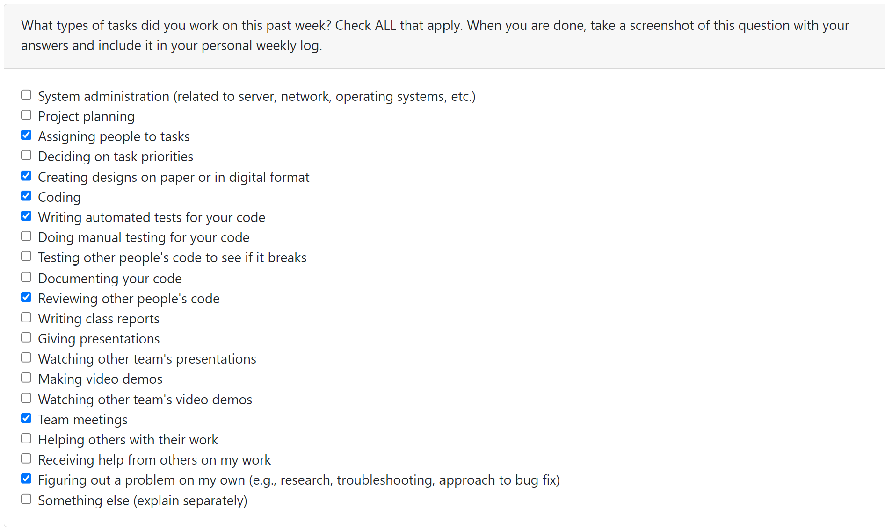

# [Esteban Martinez](https://github.com/PatchFact) Personal Log

## Sept 18 2023 -> Sept 24 2023

 
_Team Evaluation Screenshot_

### Tasks

| Feature                      | Issue(s)                                                         | Status    | Notes            |
| ---------------------------- | ---------------------------------------------------------------- | --------- | ---------------- |
| Create GitHub Projects Board | [Organize GitHub Projects][1]                                    | Completed |                  |
| Logs/Documentation           | [Individual Log (Esteban)][2], [Update README][3], [Team Log][4] | Completed |                  |
| Create Tests                 | [Create Tests][5]                                                | Completed | w/ Liam          |
| Automate Tests               | [Create Automated Tests][6]                                      | Completed |                  |
| Find Database                | [Find Word Database][7]                                          | Completed | w/ Team in Class |

[1]: https://github.com/COSC-499-W2023/word-chain-exercise-team-7/issues/12
[2]: https://github.com/COSC-499-W2023/word-chain-exercise-team-7/issues/15
[3]: https://github.com/COSC-499-W2023/word-chain-exercise-team-7/issues/20
[4]: https://github.com/COSC-499-W2023/word-chain-exercise-team-7/issues/16
[5]: https://github.com/COSC-499-W2023/word-chain-exercise-team-7/issues/13
[6]: https://github.com/COSC-499-W2023/word-chain-exercise-team-7/issues/7
[7]: https://github.com/COSC-499-W2023/word-chain-exercise-team-7/issues/10

### Goals

-   Get an image of team dynamics and setup tools for long term
-   Try out a small exercise to get to know our workflow
-   Create an automated testing suite with GitHub Actions
-   Get a feel for logging and documenting work and experiences

### Self Reflection and Learning

Despite the brevity of this exercise, I thought it created a good opportunity for the whole team to get acquainted and to learn to use our project board. Some members of the team were new to GitHub Projects and Actions, so that was a good experience to talk through as a team. We also created a Discord server to discuss the project, and I was very satisfied with the level of engagement we have on it.

As I had worked with these tools before, I helped set up out board and teach some members the workflow with tracking Issues and relating them to pull requests, as well as setting up tests with Actions. The team became adjusted to this workflow very fast, and it seems everyone is comfortable working in this way. I thought my work was easy to accomplish but had a positive impact with the team. Liam and I worked on creating tests for the code, which was a gratifying experience, and I felt like we had good communication throughout.
