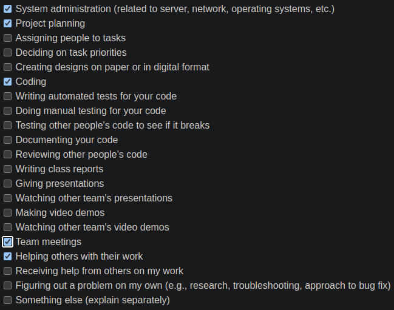

# [Ferdinand Haaben](https://github.com/Ferdinand737) Personal Log

## Oct 1 2023 -> Oct 8 2023

 
_Team Evaluation Screenshot_

 

### Goals this week

**1: Create initial database design**
| Issue                     | Pull Request             | Status    | Notes                                          |
| ------------------------- | ------------------------ | --------- | ---------------------------------------------- |
| [Database model][1]       | [Project setup][2]       | Completed |   Created database [diagram][3] and added django models |

 

[1]: https://github.com/COSC-499-W2023/year-long-project-team-7/issues/15
[2]: https://github.com/COSC-499-W2023/year-long-project-team-7/pull/19
[3]: https://dbdiagram.io/d/Capstone-651f4dbcffbf5169f023111f

