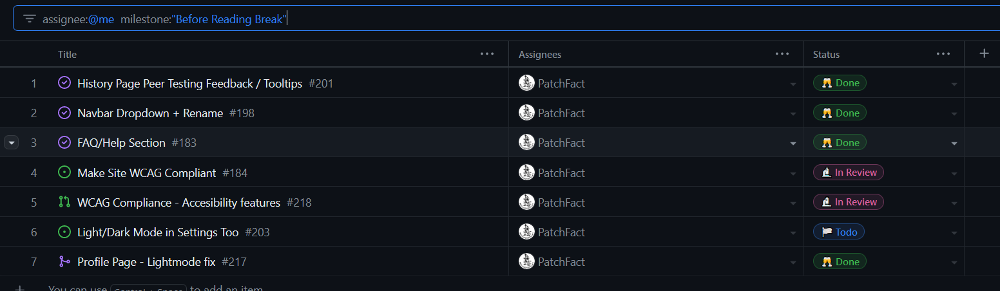

# [Esteban Martinez](https://github.com/PatchFact) Personal Log

## Sept 18 2023 -> Sept 24 2023

 
_Team Evaluation Screenshot_

### Tasks

| Feature                      | Issue(s)                                                         | Status    | Notes            |
| ---------------------------- | ---------------------------------------------------------------- | --------- | ---------------- |
| Create GitHub Projects Board | [Organize GitHub Projects][1]                                    | Completed |                  |
| Logs/Documentation           | [Individual Log (Esteban)][2], [Update README][3], [Team Log][4] | Completed |                  |
| Create Tests                 | [Create Tests][5]                                                | Completed | w/ Liam          |
| Automate Tests               | [Create Automated Tests][6]                                      | Completed |                  |
| Find Database                | [Find Word Database][7]                                          | Completed | w/ Team in Class |

[1]: https://github.com/COSC-499-W2023/word-chain-exercise-team-7/issues/12
[2]: https://github.com/COSC-499-W2023/word-chain-exercise-team-7/issues/15
[3]: https://github.com/COSC-499-W2023/word-chain-exercise-team-7/issues/20
[4]: https://github.com/COSC-499-W2023/word-chain-exercise-team-7/issues/16
[5]: https://github.com/COSC-499-W2023/word-chain-exercise-team-7/issues/13
[6]: https://github.com/COSC-499-W2023/word-chain-exercise-team-7/issues/7
[7]: https://github.com/COSC-499-W2023/word-chain-exercise-team-7/issues/10

### Goals

-   Get an image of team dynamics and setup tools for long term
-   Try out a small exercise to get to know our workflow
-   Create an automated testing suite with GitHub Actions
-   Get a feel for logging and documenting work and experiences

### Self Reflection and Learning

Despite the brevity of this exercise, I thought it created a good opportunity for the whole team to get acquainted and to learn to use our project board. Some members of the team were new to GitHub Projects and Actions, so that was a good experience to talk through as a team. We also created a Discord server to discuss the project, and I was very satisfied with the level of engagement we have on it.

As I had worked with these tools before, I helped set up out board and teach some members the workflow with tracking Issues and relating them to pull requests, as well as setting up tests with Actions. The team became adjusted to this workflow very fast, and it seems everyone is comfortable working in this way. I thought my work was easy to accomplish but had a positive impact with the team. Liam and I worked on creating tests for the code, which was a gratifying experience, and I felt like we had good communication throughout.

## Sept 24 2023 -> Oct 1 2023

 
_Team Evaluation Screenshot_

 

### Tasks

| Feature                   | Issue(s)                            | Status             | Notes                      |
| ------------------------- | ----------------------------------- | ------------------ | -------------------------- |
| Create Project Plan       | None                                | Completed          | w/Liam, Keiran, Ferdinand  |
| Personal Log              | [Individual Log (Esteban)][8]       | Completed          |                            |
| Contribute to Team Log    | [Team Log][9]                       | Completed          | w/ Liam, Keiran, Ferdinand |
| Consolidate Previous Logs | [Added logs from previous week][10] | Waiting for Review |                            |

[8]: https://github.com/COSC-499-W2023/year-long-project-team-7/issues/11
[9]: https://github.com/COSC-499-W2023/year-long-project-team-7/issues/12
[10]: https://github.com/COSC-499-W2023/year-long-project-team-7/pull/7

### Goals

-   Create a project plan to guide us with the project and help partition the work
-   Decide on a Tech Stack we feel comfortable with
-   Get an idea for how we will subdivide the work going forward
-   Determine a MVP to keep scope and expectations under control

### Self Reflection and Learning

This week's meeting was particularly important in determining how to move forward with the project. In particular, we needed to narrow down the idea we have for it into a minimum viable product (MVP) and roughly break this down into sections we expect to work on.

One of the challenges this week was trying to predict our workload for the coming year. We are all very aware that these kinds of plans are often subject to change, but we wanted to have a timeline that was as realistic as possible to our actual needs. This was challenging, but we hope that our plan is robust enough to guide us as the project becomes more complicated.

## Oct 1 2023 -> Oct 8 2023

 
_Team Evaluation Screenshot_

 

### Tasks

| Feature                    | Issue(s)                         | Status    | Notes                      |
| -------------------------- | -------------------------------- | --------- | -------------------------- |
| Unify Personal Logs        | [Consolidated Personal Logs][11] | Completed |                            |
| Personal Log               | None                             | Completed |                            |
| Contribute to Team Log     | [Team Log][12]                   | Completed | w/ Liam, Keiran, Ferdinand |
| Set Up Working Environment | [Set Up Working Environment][13] | Completed |                            |
| Help Teammates Setup WSL   | None                             | Completed | w/ Liam                    |

[11]: https://github.com/COSC-499-W2023/year-long-project-team-7/issues/18
[12]: https://github.com/COSC-499-W2023/year-long-project-team-7/issues/26
[13]: https://github.com/COSC-499-W2023/year-long-project-team-7/issues/24

### Goals

-   Set up the project working environment for everyone
-   Troubleshoot Operating System issues
-   Make a basic landing page and navigation functionality

### Self Reflection and Learning

This week was slower than others because of the ramping up of work in other classes, as well as the unexpected issues we faced when setting up the project in all of our machines. This required an additional meeting and troubleshooting to be able to get everyone up to speed.

Despite this challenge, we were able to work through the issues we had and have a basic landing page set up. We are confident about the work moving forward.

## Oct 8 2023 -> Oct 22 2023

 
_Team Evaluation Screenshot_

 

### Tasks

### Goals

-   Create front end for landing page
    -   Content
    -   Animations + Style
-   Create workflow for automatic formatting
    -   GitHub Actions
-   Troubleshoot Javascript issues w/ Ferdinand
-   Troubleshoot CSS issues

### Self Reflection and Learning

In this week I saw good progress with my personal task and felt like I learned to work with CSS in a better way this week. Creating the landing page was simple, but I wanted to have a sophisticated look that reflected modern design language. For this reason, I got more involved with bootstrap CSS and had a fair bit of fun learning to create more interesting design.

Additionally, in this two week period I wanted to create something that would help out the CI process for the whole team. I had previously used an autoformatting tool set up with GitHub actions, so I decided to do the same for this project. I investigated some options and landed on Black for Python and DjLint for HTML with Django. I set up a YAML file to automatically format the code as we push it to the repo. I feel like this change will make our codebase more readable and standarized, and generally keep things tidy in the future.

## Oct 22 2023 -> Oct 29 2023

 
_Team Evaluation Screenshot_

 

### Tasks

### Goals

-   Create front end for about page
    -   Content
    -   Style
-   Improve Styling of Navbar
    -   Make it sticky
    -   Better styling for accessibility
-   Style transformer page ahead of presentation

### Self Reflection and Learning

This week I mainly focused on getting the front end of our project to a good level prior to our presentation. We wanted a better looking navbar, as well as to prepare the look for the about page and the transformer page.

Unfortunately, at the time of writing I am not done styling the transformer page, but will do so still as part of this milestone ahead of our presentation. This is the first time I feel like I was not able to fully realise all the work I assigned myself this week, so I am re-evaluating my workflow finish tasks earlier in the week and leave time for troubleshooting which usually happens unexpectedly. I think this is a good lesson in preempting problems and taking that into account when thinking about tasks.

I had a chance to use GIMP to modify a free icon for our purposes. This was a nice creative change from the usual work that I enjoyed. I also contributed in keeping with best practices by pruning some deprecated dependencies from the project.

## Oct 29 2023 -> Nov 05 2023

 
_Team Evaluation Screenshot_

 

### Tasks

### Goals

-   Improve Styling of Transformer Page
-   Fix Bugs
    -   Javascript not working
    -   Pathing errors

### Self Reflection and Learning

My goals for this week were simply to improve the styling for the transformer page of the application and work on some bugs.

Most of our attention this week went towards building up the app ahead of the presentation, so we wanted to be sure that everything that we currently had was working. For this reason, we didn't stretch ourselves with new features and instead focused on refining our current product.

## Nov 06 2023 -> Nov 12 2023

 
_Team Evaluation Screenshot_

 

### Tasks

### Goals

-   Implement loading screen for transformations
-   Navbar conditional links

### Self Reflection and Learning

I enjoyed finding an interesting way to style the loading animation and exploring AJAX and jQuery.

## Nov 13 2023 -> Nov 26 2023

 
_Team Evaluation Screenshot_

 

### Tasks

### Goals

-   Create a PDF preview after conversion so the user can see it before downloading
-   Change scrollbar (closed as won't fix)
-   Small streamling to base.html templating

### Self Reflection and Learning

This week was an interesting challenge as I had never worked with embedded content in HTML like PDFs. I found that the challenge of converting a `.pptx` file to a `.pdf` is actually a lot more complicated that it might have seemed at first, and the solutions I have researched so far have no yielded the results I am after. For this reason, I will continue to work on this problem and hopefully come to a better solution for displaying the preview coming into next week.

## Nov 27 2023 -> Dec 03 2023

 
_Team Evaluation Screenshot_

 

### Tasks

### Goals

-   Create a PDF preview after conversion using a subroutine
-   Display the PDF with `PDF.js`

### Self Reflection and Learning

After extensive research between code-only solutions (which were imperfect and too complex) and using Windows COM services and subroutines, I finally settled on an approach for my conversion. I decided to launch a subroutine from code to LibreOffice's slides CLI services in headless mode. This allows us to convert any PowerPoint to a PDF easily, but requires that the server we run the website on have access to LibreOffice. This is fine for our purposes, since all Linux distributions include LibreOffice by default.

Rendering the PDF was a different challenge, but I finally found a solution in using Mozilla's `PDF.js` library. This library allows us to render PDFs in the browser by defining a canvas, and we can fetch the files from the file system by using Django models. I was very happy with my solution and finally achieving my end result after all the work I put into it. At the moment my solution still needs work to allow the user to scroll through all the pages of the PDF, but I have laid the groundwork to make this possible and feel happy with my work.

## Jan 09 2024 -> Jan 14 2024

 
_Team Evaluation Screenshot_

 

### Tasks

### Goals

-   Make the PDF display be able to flip through pages
-   PDF Download button not working (bug)
-   Code Review
-   Testing for PDF features

### Self Reflection and Learning

Moving forward I will be focusing on developing the social aspect of our app. The goal will be to make it so users can share presentations they have created and be able to share the specific style of their presentations for other users to build off from. To this end, this week I focused on giving the best feedback I could for the code review, so that everyone may merge their branches and get started on our new focus for the term.

This week I worked more with the `PDF.js` library and jQuery to be able to flip through the pages of the PDF as we are able to preview it fully, which involved fixing a bug that would not let a user download the PDF file as well as the PPTX file. I also worked on some test which verify that the `soffice` tool is available to the system when hosting the app, and which does a trial of the conversion to verify the command works. I will need to complete some more rigorous tests, like properly mocking a generated file and checking for an accompanying PDF, as well as testing the download functionality in case another bug like the last one shows up in the future.

## Jan 15 2024 -> Jan 21 2024

 
_Team Evaluation Screenshot_

 

### Tasks

### Goals

-   [x] Help Liam with Merge Problem
-   [x] Code Review
-   [x] Dark/Light mode Switch
-   [ ] Change all units to relative
-   [x] Figure out frontend approach
    -   [x] Investigate common responsive techniques
    -   [x] Investigate Bootstrap
    -   [x] Start on responsive design
-   [x] Define a system for stylesheets
-   [x] Merge and Review PRs

### Self Reflection and Learning

This week saw some significant changes in the plan for the project. We were told that our MVP for the project was insufficient and did not meet the expecations of the client and our supervisor. This case as a surprise to us, and as such we are working on proposals about how to change our course. As such, I will no longer be working on the proposed social features since we have decided to drop them. Instead, I am working on making our site responsive so it can be used with mobiles, tablets, and desktop.

This week I began to work on some of the aspects of responsive design, starting with the transformer page for the app. I have been investigating further into Bootstrap and the common responsive techniques of modern CSS. I reorganized our CSS files to use variables and predefined color palettes to make them easier to maintain. I also implemented a light/dark mode switch feature to make the UI more appealing to a wider number of users. I have begun the process of changing our units into relative ones which will better scale with the responsive layout, but have not yet finished this process.

## Jan 22 2024 -> Jan 28 2024

 
_Team Evaluation Screenshot_

 

### Tasks

### Goals

-   [x] Code Review
-   [x] Bug fix `light-mode`
-   [x] Responsive
    -   [x] Global
        -   [x] Margin for navbar
        -   [x] Relative units
        -   [x] Font sizes
    -   [x] Navbar
        -   [x] Responsive
        -   [x] Make navbar not sticky in mobile
        -   [ ] Nice to have: Slide from Right?
    -   [x] Home
        -   [x] Proper centering
        -   [x] No background animation for mobile
    -   [x] About/FAQ
        -   [x] Proper centering
        -   [x] Width
    -   [x] Transform
        -   [ ] Nice to have: Info Hovers
        -   [x] Input
        -   [x] Options
        -   [x] Template
        -   [x] Submit Button
    -   [x] Login/Logout/Register
        -   [x] Template refactor
        -   [x] Responsive
    -   [x] Store
    -   [ ] History
        -   [ ] Full styling

### Self Reflection and Learning

This week my goal was to finish the process of making the site fully responsive ahead of peer evaluations. I managed to style the entire site, with the exception of the `history` page with had to be reworked due to a bug. I found this process to be very interesting, albeit very demanding. I implemented CSS flexbox and grid patterns as well as media queries and other responsive design techniques. I also managed to optimize our template code reuse slightly in the processes and lint most of our templates to be much more readable. I find that the new way I organized our CSS stylesheet helped speed up the process tremendously and I am very happy with my results with the page. I feel that our site looks very good in any screen size, and I am proud of the work I managed to achieve for this period.

## Jan 29 2024 -> Feb 5 2024

 
_Team Evaluation Screenshot_

 

### Tasks

### Goals

-   [x] Remove History Page Test Bug
-   [x] Results Page/History Page Light Mode Bug
-   [x] Test production app
    -   [x] Make notes
    -   [x] Code review
    -   [x] Bug fixing
    -   [x] Merge conflicts before peer testing
-   [x] Peer Testing Survey Questions and Tasks

### Self Reflection and Learning

This week our team was focused on getting prepared for peer testing to make sure we got the most value out of it as possible. As such, I did not work on new features, instead I focused on making sure our existing material was ready in the production site for the peer evaluation. I also worked with Keiran to design the tasks we would give our evaluators. As well as the rest of the team, I spent time manually testing our production site and producing bug reports for the team so that we would be ready to show off our site to the other teams.

I unfortunately became sick during the weekend, so I was not able to get started on the features I have planned for next week. This will include adding tooltips to our transformation page, creating an FAQ page, as well as making the site WCAG compliant for accessibility. I will also begin working on our new feature, exercise creation.

Since a lot of my work was done this week in person with the team, it is not reflected in the GitHub Project.

## Feb 6 2024 -> Feb 12 2024

 
_Team Evaluation Screenshot_

 

### Tasks

### Goals

- [x] Transform
	- [x] Tooltips
- [x] FAQ/Help/Transform Info
	- [x] Clarify what things are doing
- [x] History
	- [x] Responsive
	- [x] Peer testing improved UX
- [x] Results Page
	- [x] Responsive
	- [x] PDF Preview Fix
- [x] WCAG Start
	- [x] Test screen reader

### Self Reflection and Learning

This week I worked on some peer feedback we got from our evaluation. These changes were focused on improving the user experience of the site. As part of this, I added a new FAQ section to the site and renamed the "Transform Page" to "Create". I also added tooltips to the presentation creation tool and made the results page communicate what elements are clicklable more clearly. I also fixed some issues our PDF previews were having when displayed in smaller screens and restyled the results. I've gotten started with the work of making our site more accessible by implementing WCAG development practices and begun testing with a screenreader. 

A lot of the time I spent this week was in troubleshooting the bootstrap "tooltip" plugin. Due to an obscure conflicting rule in our styling, the tooltips were not working as needed. This halted progress for about a day and was a difficult problem to solve as it involved thorough reading of the Bootstrap documentation and manually working through our styling rules to locate the problem.

## Feb 13 2024 -> Feb 18 2024

 
_Team Evaluation Screenshot_

 

### Tasks

### Goals

- [x] WCAG
	- [x] Axe DevTools Auto Errors
	- [x] Contrast
	- [x] Screen Reader + Keyboard Accessibility
		- [x] Homepage
		- [x] About/FAQ
		- [x] Create
			- [x] Input
				- [x] Enter key choose file
			- [x] Options
				- [x] Sliders
				- [x] Combobox enter key selection
			- [x] Template
				- [x] Enter key selection
				- [x] Tab highlighting and labels
			- [x] Generate button
		- [x] History
		- [x] Login + Register
		- [x] Logout
- [x] Code review + merge
- [x] Profile page light mode bug

### Self Reflection and Learning

This week I was able to complete our WCAG accessibility features. This was a challenging and rewarding task that involved getting deep into the documentation of the `aria` family of HTML properties as well as using a screen reader and keyboard only navigation to access the accessibility of our site. Some semantic and layout reworking was needed, particularly for our main "Create" page. This involved rethinking our approach to how our elements are presented and styled. I needed to end up with the same visual style and functionality as well as maintain our responsiveness while making the form understandable for visually impaired users and keyboard only users. 

This process helped me understand the way that proper semantic layouts and elements are imperative for users who depend on accessibility features. This ultimately resulted in layouts which are more semantically correct, readable, and better for users and from a maintainablility standpoint. I now think that adhering to these best practices in general and considering all types of users from the start actually results in better code from the start and I am happy we implemented these features.