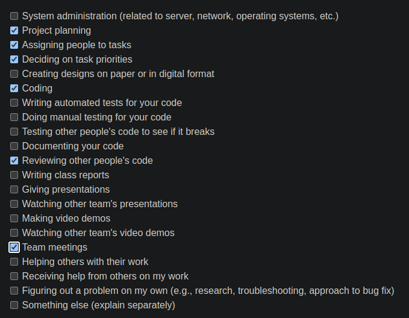

# [Ferdinand Haaben](https://github.com/Ferdinand737) Personal Log

## Sept 18 2023 -> Sept 24 2023

 
_Team Evaluation Screenshot_

### Recap

| Feature                   | Issue(s)                 | Status    | Notes |
| ------------------------- | ------------------------ | --------- | ----- |
| Implement word-chain code | [Game Implementation][1] | Completed |       |
| Documentation/Logs        | [documentation][2]       | Completed |       |
|                           |                          |           |       |

[1]: https://github.com/COSC-499-W2023/word-chain-exercise-team-7/issues/11
[2]: https://github.com/COSC-499-W2023/word-chain-exercise-team-7/tree/logs

## Sept 24 2023 -> Oct 1 2023

 
_Team Evaluation Screenshot_

 

### Goals this week

**1: Set up django project**
| Issue | Pull Request | Status | Notes |
| ------------------------- | ------------------------ | --------- | ---------------------------------------------- |
| [Set up project][3] | [Project setup][4] | Completed | Docker+database, Django, How-to instructions |

 

**2: Complete project plan**
| Issue | Pull Request | Status | Notes |
| ------------------------- | ------------------------ | --------- | -----------------|
| [Project Plan][5] | N/A | Completed | [GoogleDoc][6] |

[3]: https://github.com/COSC-499-W2023/year-long-project-team-7/issues/5
[4]: https://github.com/COSC-499-W2023/year-long-project-team-7/pull/6
[5]: https://github.com/COSC-499-W2023/year-long-project-team-7/issues/2
[6]: https://docs.google.com/document/d/18U3K607QbEoZFy_O4bKOMl64O0OOUe0IOVW4NVq2NdY/edit?pli=1

## Oct 1 2023 -> Oct 8 2023

 
_Team Evaluation Screenshot_

 

### Goals this week

**1: Create initial database design**
| Issue | Pull Request | Status | Notes |
| ------------------------- | ------------------------ | --------- | ---------------------------------------------- |
| [Database model][7] | [Project setup][8] | Completed | Created database [diagram][9] and added django models |

 

[7]: https://github.com/COSC-499-W2023/year-long-project-team-7/issues/15
[8]: https://github.com/COSC-499-W2023/year-long-project-team-7/pull/19
[9]: https://dbdiagram.io/d/Capstone-651f4dbcffbf5169f023111f

## Oct 8 2023 -> Oct 15 2023

 
_Team Evaluation Screenshot_

 

 
_Tasks Screenshot_

 

### Goals this week

**1: Basic File Ingestion Functionality**
| Issue | Pull Request | Status | Notes |
| ----------------------------------- | --------------------------------- | --------- | ---------------------------------------------- |
| [File Ingestion Page Design][10] | [Basic Tansformer page][11] | Completed | Inital page design |
| [File Ingestion Implementation][12] | [Basic Tansformer page][11] | Completed | User can upload files. Storage in files and db |

 

**2: Complete Database Design**

| Issue                  | Pull Request      | Status    | Notes                                    |
| ---------------------- | ----------------- | --------- | ---------------------------------------- |
| [Database Diagram][13] | [Add to docs][14] | Completed | Current Database design, Will be updated |

[10]: https://github.com/COSC-499-W2023/year-long-project-team-7/issues/16
[11]: https://github.com/COSC-499-W2023/year-long-project-team-7/pull/37
[12]: https://github.com/COSC-499-W2023/year-long-project-team-7/issues/31
[13]: https://github.com/COSC-499-W2023/year-long-project-team-7/issues/35
[14]: https://github.com/COSC-499-W2023/year-long-project-team-7/pull/49

## Oct 16 2023 -> Oct 22 2023

 
_Team Evaluation Screenshot_

 

 
_Tasks Screenshot_

 

## Oct 22 2023 -> Oct 29 2023

 
_Team Evaluation Screenshot_

 

 
_Tasks Screenshot_

## Oct 29 2023 -> Nov 6 2023

 
_Team Evaluation Screenshot_

 

 
_Tasks Screenshot_

## Nov 6 2023 -> Nov 26 2023

_Team Evaluation Screenshot Week 12_

 

 
_Tasks Screenshot_

## Nov 26 2023 -> Dec 3 2023

_Team Evaluation Screenshot Week 13_

 

 
_Tasks Screenshot_

## Dec 3 2023 -> Jan 14

_Team Evaluation Screenshot Week 14,15_

 

 
_Tasks Screenshot_

## Jan 14 2024 -> Jan 21 2024

_Team Evaluation Screenshot Week 16_

 

 
_Tasks Screenshot_

## Jan 22 2024 -> Jan 28 2024

_Team Evaluation Screenshot Week 17_

 

 
_Tasks Screenshot_

## Jan 29 2024 -> Feb 11 2024

_Team Evaluation Screenshot Week 17_

 

 
_Tasks Screenshot_

## Feb 11 2024 -> Mar 3 2024

 
_Team Evaluation Screenshot Week 22_

 
_Tasks Screenshot_

## Mar 3 2024 -> Mar 24 2024

 
_Team Evaluation Screenshot Week 26_

 
_Tasks Screenshot_