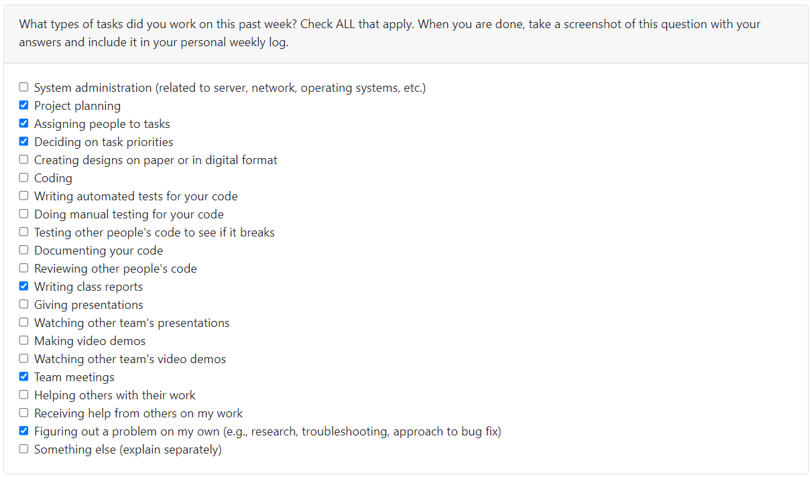
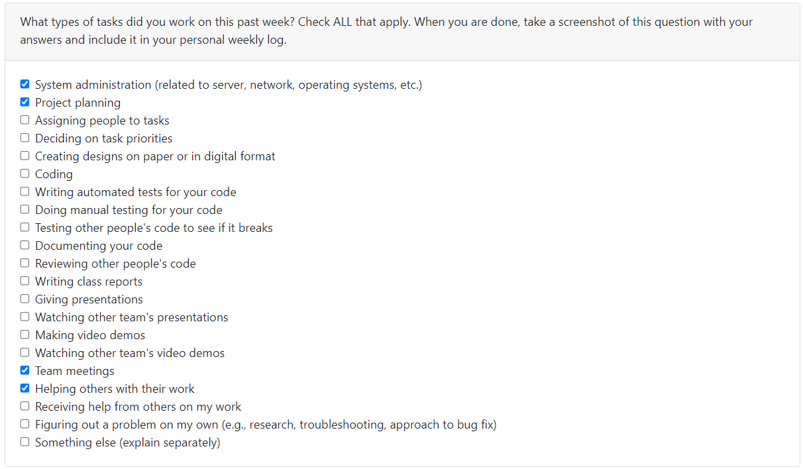
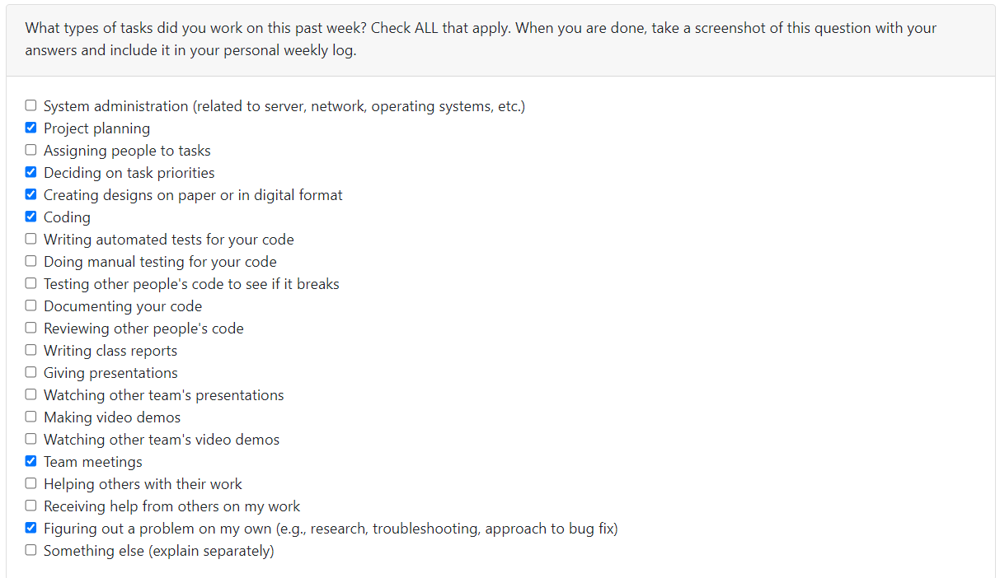
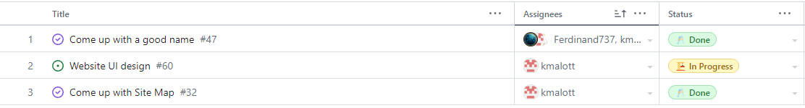
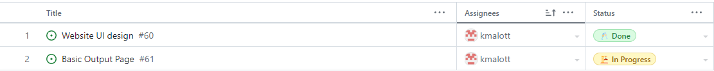
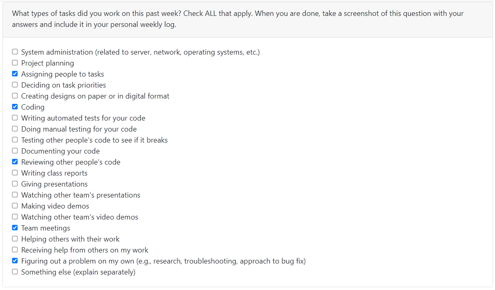

# [Keiran Malott](https://github.com/kmalott) Personal Log

## Sept 18 2023 -> Sept 24 2023

 
_Team Evaluation Screenshot_

### Recap

| Feature            | Issue(s)                                    | Status    | Notes |
| ------------------ | ------------------------------------------- | --------- | ----- |
| Logs/Documentation | [Individual Log (Keiran)][1], [Team Log][2] | Completed |       |

[1]: https://github.com/COSC-499-W2023/word-chain-exercise-team-7/issues/18
[2]: https://github.com/COSC-499-W2023/word-chain-exercise-team-7/issues/16

## Sept 24 2023 -> Oct 1 2023

 
_Team Evaluation Screenshot_

 

### My Goals this week

- Create a project plan
- Decide on the MVP of the project
- Decide on a tech stack to use

### Tasks

| Feature             | Issue(s)                     | Status    | Notes                     |
| ------------------- | ---------------------------- | --------- | ------------------------- |
| Create Project Plan | [Project Plan][3]            | Completed | w/Liam, Keiran, Ferdinand |
| Personal Log        | [Individual Log (Keiran)][4] | Completed |                           |

[4]: https://github.com/COSC-499-W2023/year-long-project-team-7/issues/10
[3]: https://github.com/COSC-499-W2023/year-long-project-team-7/issues/13

## Oct 1 2023 -> Oct 8 2023

 
_Team Evaluation Screenshot_

 

### Goals this week

- Set up project environment
- Research tech stack
- Fix project environment setup issues

### Tasks

| Feature                   | Issue(s)                           | Status             | Notes                      |
| ------------------------- | ---------------------------------- | ------------------ | -------------------------- |
| Personal Log              | None      | Completed          |   
| Contribute to Team Log     | [Team Log][5]                   | Completed | w/ Liam, Esteban, Ferdinand |
| Set up Working environment | [Set up wokring environment][6] | Completed | 

[5]: https://github.com/COSC-499-W2023/year-long-project-team-7/issues/26
[6]: https://github.com/COSC-499-W2023/year-long-project-team-7/issues/24

## Oct 8 -> Oct 15 2023

 
_Team Evaluation Screenshot_

 
_Tasks Screenshot_

[Individual W6 Tasks][7]

### Goals this week
1. Continue tech stack research
2. Create sitemap
3. Start creating UI sketches

[7]: https://github.com/orgs/COSC-499-W2023/projects/1/views/8?filterQuery=assignees%3Akmalott++milestone%3A%22Week+6%22&sortedBy%5Bdirection%5D=asc&sortedBy%5BcolumnId%5D=Assignees

## Oct 15 -> Oct 22 2023

 
_Team Evaluation Screenshot_

 
_Tasks Screenshot_

[Individual W7 Tasks][8]

### Goals this week
1. Finish creating UI sketches
2. Create basic results page

[8]: https://github.com/orgs/COSC-499-W2023/projects/1/views/8?filterQuery=assignees%3Akmalott++milestone%3A%22Week+7%22+&sortedBy%5Bdirection%5D=asc&sortedBy%5BcolumnId%5D=Assignees

## Oct 23 -> Oct 29

_Team evaluation Screenshot_

_Tasks Screenshot_

[Individual W8 Tasks][9]

### Goals this week
1. Update Results page based on TA/Group member feedback
2. Create slides for W9 mini presentation
3. Update Log in / Sign up UI