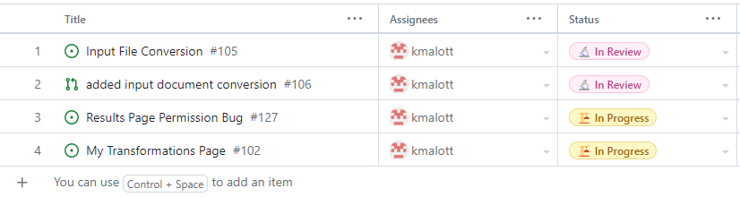

# [Keiran Malott](https://github.com/kmalott) Personal Log

## Sept 18 2023 -> Sept 24 2023

 
_Team Evaluation Screenshot_

### Recap

| Feature            | Issue(s)                                    | Status    | Notes |
| ------------------ | ------------------------------------------- | --------- | ----- |
| Logs/Documentation | [Individual Log (Keiran)][1], [Team Log][2] | Completed |       |

[1]: https://github.com/COSC-499-W2023/word-chain-exercise-team-7/issues/18
[2]: https://github.com/COSC-499-W2023/word-chain-exercise-team-7/issues/16

## Sept 24 2023 -> Oct 1 2023

 
_Team Evaluation Screenshot_

 

### My Goals this week

- Create a project plan
- Decide on the MVP of the project
- Decide on a tech stack to use

### Tasks

| Feature             | Issue(s)                     | Status    | Notes                     |
| ------------------- | ---------------------------- | --------- | ------------------------- |
| Create Project Plan | [Project Plan][3]            | Completed | w/Liam, Keiran, Ferdinand |
| Personal Log        | [Individual Log (Keiran)][4] | Completed |                           |

[4]: https://github.com/COSC-499-W2023/year-long-project-team-7/issues/10
[3]: https://github.com/COSC-499-W2023/year-long-project-team-7/issues/13

## Oct 1 2023 -> Oct 8 2023

 
_Team Evaluation Screenshot_

 

### Goals this week

- Set up project environment
- Research tech stack
- Fix project environment setup issues

### Tasks

| Feature                   | Issue(s)                           | Status             | Notes                      |
| ------------------------- | ---------------------------------- | ------------------ | -------------------------- |
| Personal Log              | None      | Completed          |   
| Contribute to Team Log     | [Team Log][5]                   | Completed | w/ Liam, Esteban, Ferdinand |
| Set up Working environment | [Set up wokring environment][6] | Completed | 

[5]: https://github.com/COSC-499-W2023/year-long-project-team-7/issues/26
[6]: https://github.com/COSC-499-W2023/year-long-project-team-7/issues/24

## Oct 8 -> Oct 15 2023

 
_Team Evaluation Screenshot_

 
_Tasks Screenshot_

[Individual W6 Tasks][7]

### Goals this week
1. Continue tech stack research
2. Create sitemap
3. Start creating UI sketches

[7]: https://github.com/orgs/COSC-499-W2023/projects/1/views/8?filterQuery=assignees%3Akmalott++milestone%3A%22Week+6%22&sortedBy%5Bdirection%5D=asc&sortedBy%5BcolumnId%5D=Assignees

## Oct 15 -> Oct 22 2023

 
_Team Evaluation Screenshot_

 
_Tasks Screenshot_

[Individual W7 Tasks][8]

### Goals this week
1. Finish creating UI sketches
2. Create basic results page

[8]: https://github.com/orgs/COSC-499-W2023/projects/1/views/8?filterQuery=assignees%3Akmalott++milestone%3A%22Week+7%22+&sortedBy%5Bdirection%5D=asc&sortedBy%5BcolumnId%5D=Assignees

## Oct 23 -> Oct 29

_Team evaluation Screenshot_

_Tasks Screenshot_

[Individual W8 Tasks][9]

### Goals this week
1. Update Results page based on TA/Group member feedback
2. Create slides for W9 mini presentation
3. Update Log in / Sign up UI

[9]: https://github.com/orgs/COSC-499-W2023/projects/1/views/1?filterQuery=assignee%3Akmalott+milestone%3A%22Week+8%22

## Oct 30 -> Nov 05

_Team evaluation Screenshot_

_Tasks Screenshot_

[Individual W9 Tasks][10]

### Goals this week
1. Finish updating Log in / SIgn up UI
2. Update slides for mini presentation
3. Complete feedback for other teams mini presentation

[10]: https://github.com/orgs/COSC-499-W2023/projects/1/views/8?filterQuery=assignee%3Akmalott+milestone%3A%22Week+9%22+

## Nov 06 -> Nov 12

_Team evaluation Screenshot_

_Tasks Screenshot_

[Individual W10 Tasks][11]

### Goals this week
1. Add conversion to pdf for documents inputted to the transformer

[11]: https://github.com/orgs/COSC-499-W2023/projects/1/views/8?filterQuery=assignee%3Akmalott+milestone%3A%22Week+10%22+

## Nov 13 -> Nov 26

_Team evaluation Screenshot_

_Tasks Screenshot_

[Individual W12 Tasks][12]

### Goals this week
1. Create testing for document conversion
2. Basic My Transformations Page (history of users previous transformations)

Note that 2. is not in master branch at the moment. See my-transformations branch for my commmits this week

### Self Reflection and Learning

For this week my main goals were to create testing for the work I completed last week and create a basic version of the my transformations page. Unfortunately, creating testing for the document conversion functions was unexpectedly challenging and I at this time I don't have any tests written for this. However, I believe that by the end of next week I should have testing implemented for this feature. Despite this setback throughout the week I have learned a lot about django testing in general which will be very useful as I continue to work on this project. Fortunately, my second goal this week went a lot better than the first and I was able to make very good progress in creating the my transformations page. I am hopeful that by the end of next week I will have a more polished version to add to the master branch with the necessary testing required for it. 

[12]: https://github.com/orgs/COSC-499-W2023/projects/1/views/8?filterQuery=milestone%3A%22Week+12%22+assignee%3Akmalott

## Nov 27 -> Dec 3

_Team evaluation Screenshot_

_Tasks Screenshot_

[Individual W13 Tasks][13]

### Goals this week
1. Complete Team Design Document
2. Basic Store Page
3. Improve My Transformations Page + Testing

Note that 3. is still not in the master branch it can be found in my-transformations branch. 
Also 2. is in store-page branch

### Self Reflection and Learning

For this week my main goal was to work with the rest of the team to complete our design document that is due at the end of the week. Fortunately, creating the design document was a relatively straightforward process as most of the design diagrams had already been completed near the beginning of the project. My next goal was to create a basic store page that lists all subscription products available. I was able to complete the store page and associated testing this week. My final goal was to continue improving the my transformations page started last week. Unfortunately, while improving the page I ran into a lot of issues with django databases that prevented me from having enough time to write complete testing for the page. While I was able to create some testing, I do not feel it is complete and therefore I won't be pushing the branch to master until I am able to complete the testing in a later milestone. 

[13]: https://github.com/orgs/COSC-499-W2023/projects/1/views/1?filterQuery=-no%3Amilestone+assignee%3A%40me+milestone%3A%22Week+13%22+

## Jan 9 -> Jan 14

_Team evaluation Screenshot_

_Tasks Screenshot_

[Individual W15 Tasks][14]

### Goals this week
1. My Transformation page testing
2. Stripe payment integration (subscription_checkout branch)

[14]: https://github.com/orgs/COSC-499-W2023/projects/1/views/8?filterQuery=milestone%3A%22Week+15%22++assignee%3A%40me

## Jan 15 -> Jan 21

_Team evaluation Screenshot_

_Tasks Screenshot_

[Individual W16 Tasks][15]

### Goals this week
1. Stripe payment integration (subscription_checkout branch)

[15]: https://github.com/orgs/COSC-499-W2023/projects/1/views/8?filterQuery=+assignee%3A%40me

## Jan 22 -> Jan 28

Missed this log.

## Jan 29 -> Feb 4

_Team evaluation Screenshot_

_Tasks Screenshot_

[Individual W17 Tasks][16]

### Goals this week
1. Fix Stripe payments (subscription_checkout branch)
2. Stripe user permissions (subscription_checkout branch)

[16]: https://github.com/orgs/COSC-499-W2023/projects/1/views/8?filterQuery=+assignee%3A%40me