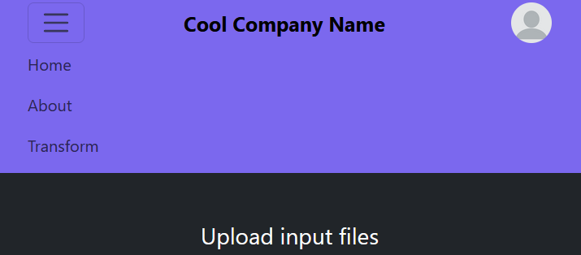
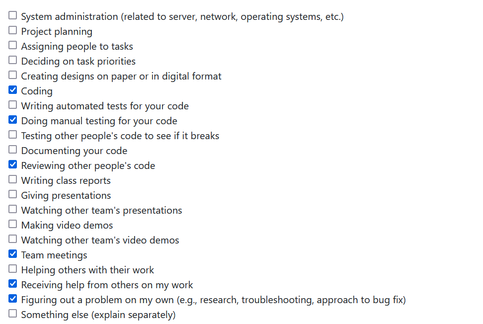
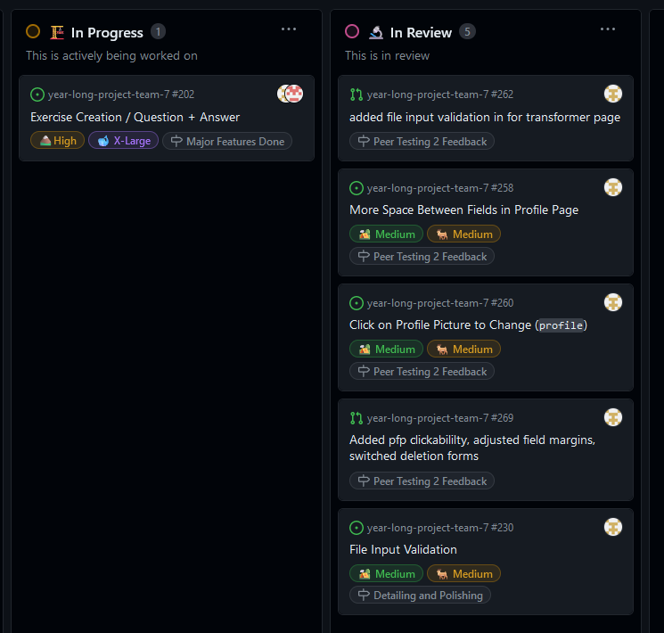
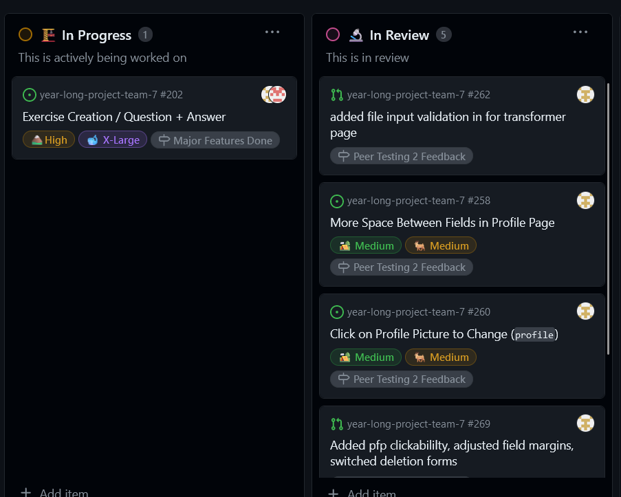

# [Liam Rasmussen](https://github.com/liamras) Personal Log

## Sept 18 2023 -> Sept 24 2023

 
_Team Evaluation Screenshot_

### Recap

| Feature       | Issue(s)     | Status    | Notes |
| ------------- | ------------ | --------- | ----- |
| Documentation | [Testing][1] | Completed |       |
|               |              |           |       |

[1]: https://github.com/COSC-499-W2023/word-chain-exercise-team-7/issues/13

## Sept 24 2023 -> Oct 1 2023

 
_Team Evaluation Screenshot_

### Goal Recap

| Goal                | Member(s)                        | Link(s)           | Status    | Notes                                                               |
| ------------------- | -------------------------------- | ----------------- | --------- | ------------------------------------------------------------------- |
| Create Project Plan | Esteban, Ferdinand, Keiran, Liam | [Project Plan][2] | Completed | All group members contributed equally and met at the group meetings |
|                     |                                  |                   |           |                                                                     |

[2]: https://docs.google.com/document/d/18U3K607QbEoZFy_O4bKOMl64O0OOUe0IOVW4NVq2NdY

## Oct 1 2023 -> Oct 8 2023

 
_Team Evaluation Screenshot_

 

### Goals this week

| Goal/Feature                  | Pull Request                                                    | Status    | Notes                                                                                                                                                     |
| ----------------------------- | --------------------------------------------------------------- | --------- | --------------------------------------------------------------------------------------------------------------------------------------------------------- |
| Setup project/Research Django |                                                                 | Completed | Ran into many technical difficulties getting project set up. Ferdinand and Esteban assisted greatly. Also researched Django in order to create home page. |
| [Create basic home page][3]   | [Created basic home page, about us page, and navigation bar][4] | Completed |                                                                                                                                                           |

 

[3]: https://github.com/COSC-499-W2023/year-long-project-team-7/issues/17
[4]: https://github.com/COSC-499-W2023/year-long-project-team-7/pull/21

## Oct 8 2023 -> Oct 15 2023

 
_Team Evaluation Screenshot_

 

### Goals/Features this week

 
[Individual Tasks][5]

 

### Additional Feature Screenshots

 
_Updated Navbar Screenshot_

 

[5]: https://github.com/orgs/COSC-499-W2023/projects/1/views/8?filterQuery=liamras

## Oct 15 2023 -> Oct 22 2023

 
_Team Evaluation Screenshot_

 

### Goals/Features this week

 
[Individual Tasks][6]

 

TODO for account functionality: Add tests, use type annotations

 

### Additional Feature Screenshots

 
_Signup page Screenshot_

 

 
_Signin page Screenshot_

 

[6]: https://github.com/orgs/COSC-499-W2023/projects/1/views/8?filterQuery=liamras

## Oct 22 2023 -> Oct 29 2023

 
_Team Evaluation Screenshot_

 

### Goals/Features this week

 
[Individual Tasks](https://github.com/orgs/COSC-499-W2023/projects/1/views/8?filterQuery=liamras)

 

## Oct 29 2023 -> Nov 5 2023

 
_Team Evaluation Screenshot_

 

### Goals/Features this week

 
Additional tasks this week: Fixing merge issues with account functionality, preparing for mini-presentations, presenting mini-presentations
 
[Individual Tasks](https://github.com/orgs/COSC-499-W2023/projects/1/views/8?filterQuery=liamras)

 

## Nov 5 2023 -> Nov 12 2023

 
_Team Evaluation Screenshot_

 

### Goals/Features this week

 
TODO: Switching to django forms broke all the original signin/signup tests this week. Have to fix before merging to master
 
[Individual Tasks](https://github.com/orgs/COSC-499-W2023/projects/1/views/8?filterQuery=liamras)

 

## Nov 12 2023 -> Nov 26 2023

 
_Team Evaluation Screenshot_

 

### Goals/Features this week

 
TODO: Still have to create tests for email verification before merging with master
 
[Individual Tasks](https://github.com/orgs/COSC-499-W2023/projects/1/views/8?filterQuery=liamras)
 
[Current feature branch](https://github.com/COSC-499-W2023/year-long-project-team-7/tree/account-email-verification)

 

## Nov 26 2023 -> Dec 3 2023

 
_Team Evaluation Screenshot_

 

### Goals/Features this week

 
TODO: Still have to create tests for email verification before merging with master
 
Note: This week was spent working on the design document / video with my team. I did not focus on features this week.
 
[Individual Tasks](https://github.com/orgs/COSC-499-W2023/projects/1/views/8?filterQuery=liamras)
 
[Current feature branch](https://github.com/COSC-499-W2023/year-long-project-team-7/tree/account-email-verification)

 

## Jan 8 2023 -> Jan 14 2024

 
_Team Evaluation Screenshot_

 

### Goals/Features this week

 
TODO: Tests are almost done. Have 1 issue left to fix before merging with master
 
[Individual Tasks](https://github.com/orgs/COSC-499-W2023/projects/1/views/8?filterQuery=liamras)
 
[Current feature branch](https://github.com/COSC-499-W2023/year-long-project-team-7/tree/account-email-verification)
 
[Latest commit](https://github.com/COSC-499-W2023/year-long-project-team-7/commit/f78409f92e7378c05308dd571481c6d46280295c)

 

## Jan 14 2023 -> Jan 21 2024

 
_Team Evaluation Screenshot_

 

### Goals/Features this week

 
Note: Account functionality has had it's merge conflicts resolved. This week they were a major issue. I'm now starting to work on the forget password system
 
[Individual Tasks](https://github.com/orgs/COSC-499-W2023/projects/1/views/8?filterQuery=liamras)
 
[Latest PR](https://github.com/COSC-499-W2023/year-long-project-team-7/pull/165)

 

## Jan 21 2023 -> Jan 28 2024

 
_Team Evaluation Screenshot_

 

### Goals/Features this week

 
Note: Basic user account functionality is complete. While there is an addionional deletion feature I'd like to add (see comment in my latest PR), I'm holding off on it until after peer reviews are complete.
 
[Individual Tasks](https://github.com/orgs/COSC-499-W2023/projects/1/views/8?filterQuery=liamras&sortedBy%5Bdirection%5D=asc&sortedBy%5BcolumnId%5D=Milestone)
 
[Latest PR](https://github.com/COSC-499-W2023/year-long-project-team-7/pull/190)

 

## Jan 28 2023 -> Feb 4 2024

 
_Team Evaluation Screenshot_

 

### Goals/Features this week

 
Note: I feel I am falling behind. The account page is turning out to involve more than I anticipated which is why it hasn't been merged yet. This week I'd like to address the issues with it that my team brought to my attention so I can deliver a branch that is up to merging standards. If possible, I will count the additional work to the account page as its own issue so I don't drag the progress of the team down. After this week, I plan on addressing the peer review feedback we got.
 
[Individual Tasks](https://github.com/orgs/COSC-499-W2023/projects/1/views/8?filterQuery=liamras&sortedBy%5Bdirection%5D=asc&sortedBy%5BcolumnId%5D=Milestone)
 
[Latest PR](https://github.com/COSC-499-W2023/year-long-project-team-7/pull/190)

 

## Feb 5 2023 -> Feb 11 2024

 
_Team Evaluation Screenshot_

 

### Goals/Features this week

 
Note: Will add forgot-password email feature this week. Plan on addressing peer review fixes over the break.
 
[Individual Tasks](https://github.com/orgs/COSC-499-W2023/projects/1/views/8?filterQuery=liamras&sortedBy%5Bdirection%5D=asc&sortedBy%5BcolumnId%5D=Milestone)
 

 

## Feb 12 2023 -> Mar 3 2024

 
_Team Evaluation Screenshot_

 

### Goals/Features this week

 
Note: I forgot to do my log for week 20. I was working on implementing the forgot password system. I never got the chance to finish it that week but I made up for it during the reading break and finished that feature along with another peer review fixes issue. This week I prepared for our next upcoming peer review by addressing issues that came up with a file deletion system I added. I also reformmated our emails to look more professional.

 
[Individual Tasks](https://github.com/orgs/COSC-499-W2023/projects/1/views/8?filterQuery=liamras&sortedBy%5Bdirection%5D=asc&sortedBy%5BcolumnId%5D=Milestone)
 

 

## Mar 4 2024 -> Mar 10 2024

 
_Team Evaluation Screenshot_

 

### Goals/Features this week

 
Note: This week I added input validation for the transformer page.

 
[Individual Tasks](https://github.com/orgs/COSC-499-W2023/projects/1/views/8?filterQuery=liamras&sortedBy%5Bdirection%5D=asc&sortedBy%5BcolumnId%5D=Milestone)
 
[Latest PR](https://github.com/COSC-499-W2023/year-long-project-team-7/pull/262)

 

## Mar 11 2024 -> Mar 17 2024

 
_Team Evaluation Screenshot_

 

### Goals/Features this week

 
[Individual Tasks](https://github.com/orgs/COSC-499-W2023/projects/1/views/8?filterQuery=liamras&sortedBy%5Bdirection%5D=asc&sortedBy%5BcolumnId%5D=Milestone)
 
[Latest PR](https://github.com/COSC-499-W2023/year-long-project-team-7/pull/269)

 

## Mar 18 2024 -> Mar 24 2024

 
_Team Evaluation Screenshot_

 

### Goals/Features this week

 
Note: This week I'm hoping to finish the exercise feature frontend.

 
[Individual Tasks](https://github.com/orgs/COSC-499-W2023/projects/1/views/8?filterQuery=liamras&sortedBy%5Bdirection%5D=asc&sortedBy%5BcolumnId%5D=Milestone)
 
[Latest PR](https://github.com/COSC-499-W2023/year-long-project-team-7/pull/278)

 

## Mar 25 2024 -> Apr 1 2024

 
_I missed the window to complete my team evaluation this week._

 

### Goals/Features this week

 
Note: This week I completed the exercise frontend and helped combine it with the backend PR. The exercise creation feature is now complete.

 
[Individual Tasks](https://github.com/orgs/COSC-499-W2023/projects/1/views/8?filterQuery=liamras&sortedBy%5Bdirection%5D=asc&sortedBy%5BcolumnId%5D=Milestone)
 
[Frontend PR](https://github.com/COSC-499-W2023/year-long-project-team-7/pull/278)
 
[Backend/combined PR](https://github.com/COSC-499-W2023/year-long-project-team-7/pull/273)

 
