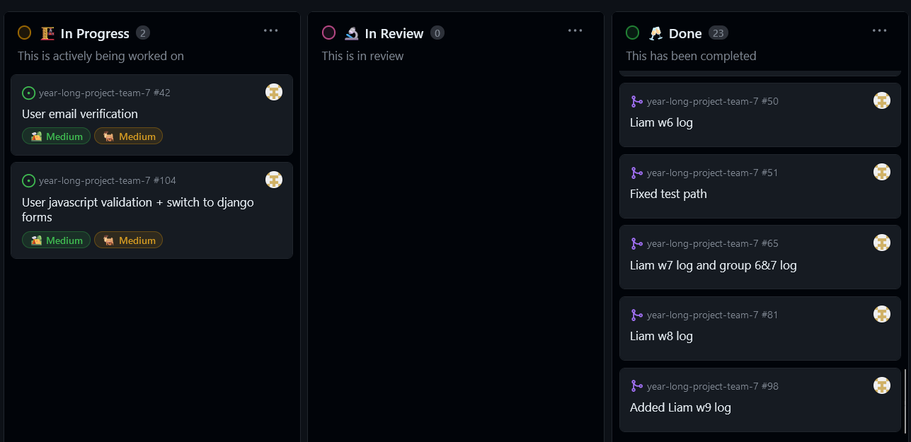

# [Liam Rasmussen](https://github.com/liamras) Personal Log

## Sept 18 2023 -> Sept 24 2023

 
_Team Evaluation Screenshot_

### Recap

| Feature       | Issue(s)     | Status    | Notes |
| ------------- | ------------ | --------- | ----- |
| Documentation | [Testing][1] | Completed |       |
|               |              |           |       |

[1]: https://github.com/COSC-499-W2023/word-chain-exercise-team-7/issues/13

## Sept 24 2023 -> Oct 1 2023

 
_Team Evaluation Screenshot_

### Goal Recap

| Goal                | Member(s)                        | Link(s)           | Status    | Notes                                                               |
| ------------------- | -------------------------------- | ----------------- | --------- | ------------------------------------------------------------------- |
| Create Project Plan | Esteban, Ferdinand, Keiran, Liam | [Project Plan][2] | Completed | All group members contributed equally and met at the group meetings |
|                     |                                  |                   |           |                                                                     |

[2]: https://docs.google.com/document/d/18U3K607QbEoZFy_O4bKOMl64O0OOUe0IOVW4NVq2NdY

## Oct 1 2023 -> Oct 8 2023

 
_Team Evaluation Screenshot_

 

### Goals this week

| Goal/Feature                  | Pull Request                                                    | Status    | Notes                                                                                                                                                     |
| ----------------------------- | --------------------------------------------------------------- | --------- | --------------------------------------------------------------------------------------------------------------------------------------------------------- |
| Setup project/Research Django |                                                                 | Completed | Ran into many technical difficulties getting project set up. Ferdinand and Esteban assisted greatly. Also researched Django in order to create home page. |
| [Create basic home page][3]   | [Created basic home page, about us page, and navigation bar][4] | Completed |                                                                                                                                                           |

 

[3]: https://github.com/COSC-499-W2023/year-long-project-team-7/issues/17
[4]: https://github.com/COSC-499-W2023/year-long-project-team-7/pull/21

## Oct 8 2023 -> Oct 15 2023

 
_Team Evaluation Screenshot_

 

### Goals/Features this week

 
[Individual Tasks][5]

 

### Additional Feature Screenshots

 
_Updated Navbar Screenshot_

 

[5]: https://github.com/orgs/COSC-499-W2023/projects/1/views/8?filterQuery=liamras

## Oct 15 2023 -> Oct 22 2023

 
_Team Evaluation Screenshot_

 

### Goals/Features this week

 
[Individual Tasks][6]

 

TODO for account functionality: Add tests, use type annotations

 

### Additional Feature Screenshots

 
_Signup page Screenshot_

 

 
_Signin page Screenshot_

 

[6]: https://github.com/orgs/COSC-499-W2023/projects/1/views/8?filterQuery=liamras

## Oct 22 2023 -> Oct 29 2023

 
_Team Evaluation Screenshot_

 

### Goals/Features this week

 
[Individual Tasks](https://github.com/orgs/COSC-499-W2023/projects/1/views/8?filterQuery=liamras)

 

## Oct 29 2023 -> Nov 5 2023

 
_Team Evaluation Screenshot_

 

### Goals/Features this week

 
Additional tasks this week: Fixing merge issues with account functionality, preparing for mini-presentations, presenting mini-presentations
 
[Individual Tasks](https://github.com/orgs/COSC-499-W2023/projects/1/views/8?filterQuery=liamras)

 

## Nov 5 2023 -> Nov 12 2023

 
_Team Evaluation Screenshot_

 

### Goals/Features this week

 
TODO: Switching to django forms broke all the original signin/signup tests this week. Have to fix before merging to master
 
[Individual Tasks](https://github.com/orgs/COSC-499-W2023/projects/1/views/8?filterQuery=liamras)

 

