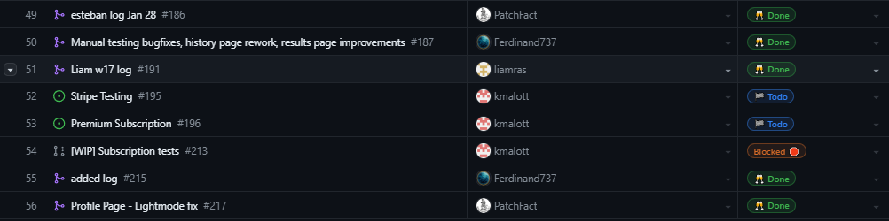

# Team 7 Log

| Full Name        | GitHub username                                 |
| ---------------- | ----------------------------------------------- |
| Esteban Martinez | [PatchFact](https://github.com/PatchFact)       |
| Ferdinand Haaben | [Ferdinand737](https://github.com/Ferdinand737) |
| Keiran Malott    | [kmalott](https://github.com/kmalott)           |
| Liam Rasmussen   | [liamras](https://github.com/liamras)           |

## Jan 29 -> Feb 18

### Recap of goals
 

 
_Burnup chart Screenshot_

 
[_Tasks Screenshot_](https://github.com/orgs/COSC-499-W2023/projects/1/views/8?filterQuery=milestone%3A%22Peer+Review%22%2C%22Before+Reading+Break%22%2C)

 

[Test Outputs](https://github.com/COSC-499-W2023/year-long-project-team-7/actions)
