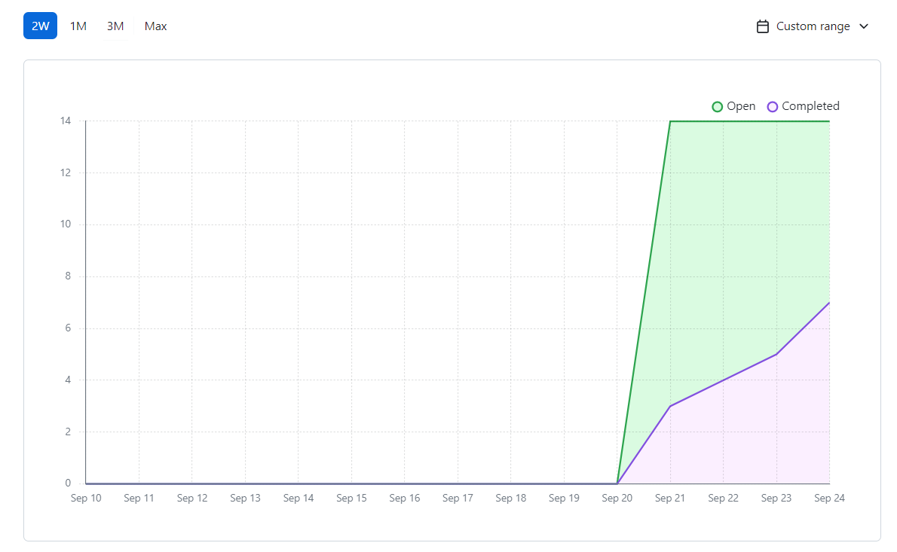
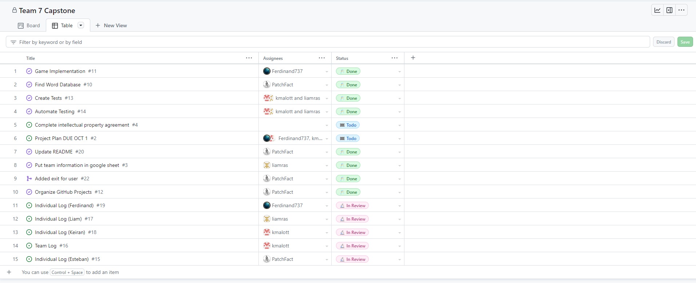
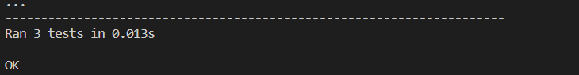

# Team 7 Log

| Full Name        | GitHub username                                 |
| ---------------- | ----------------------------------------------- |
| Esteban Martinez | [PatchFact](https://github.com/PatchFact)       |
| Ferdinand Haaben | [Ferdinand737](https://github.com/Ferdinand737) |
| Keiran Malott    | [kmalott](https://github.com/kmalott)           |
| Liam Rasmussen   | [liamras](https://github.com/liamras)           |

## Sept 18 2023 -> Sept 24 2023

### Recap of goals

| Feature                   | Issue(s)                  | Status    | Notes |
| ------------------------- | ------------------------- | --------- | ----- |
| Implement word-chain code | [Implementation][1]       | Completed |       |
| Write tests               | [Tests][2]                | Completed |       |
| Test Automation           | [Automation][3]           | Completed |       |
| Write documentation       | [TeamLog][4], [ReadMe][5] | Completed |       |

[1]: https://github.com/COSC-499-W2023/word-chain-exercise-team-7/issues/11
[2]: https://github.com/COSC-499-W2023/word-chain-exercise-team-7/issues/13
[3]: https://github.com/COSC-499-W2023/word-chain-exercise-team-7/issues/14
[4]: https://github.com/COSC-499-W2023/word-chain-exercise-team-7/issues/16
[5]: https://github.com/COSC-499-W2023/word-chain-exercise-team-7/issues/20

 

 
_Burnup chart Screenshot_

 
_Tasks table Screenshot_

 
_Test output Screenshot_
