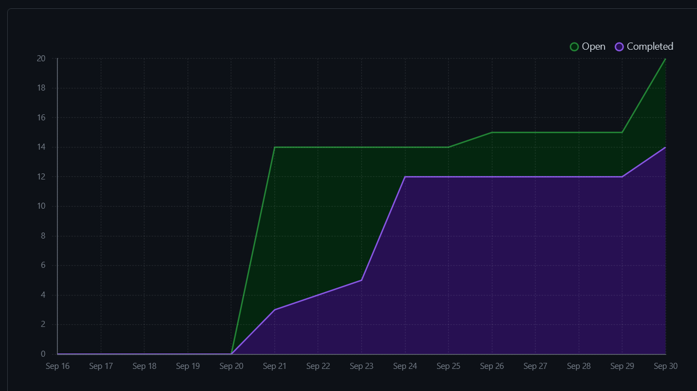
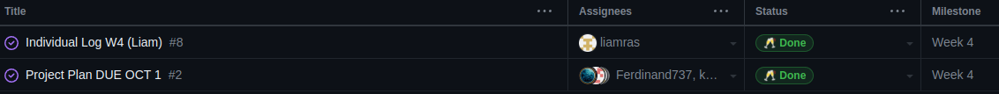
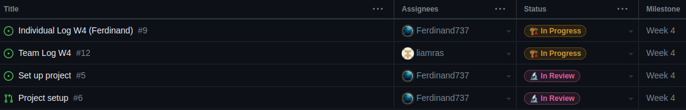

# Team 7 Log

| Full Name        | GitHub username                                 |
| ---------------- | ----------------------------------------------- |
| Esteban Martinez | [PatchFact](https://github.com/PatchFact)       |
| Ferdinand Haaben | [Ferdinand737](https://github.com/Ferdinand737) |
| Keiran Malott    | [kmalott](https://github.com/kmalott)           |
| Liam Rasmussen   | [liamras](https://github.com/liamras)           |

## Sept 24 2023 -> Oct 1 2023

### Recap of goals

| Feature               | Members                          | Link(s)                       | Status    | Notes                                                               |
| --------------------- | -------------------------------- | ----------------------------- | --------- | ------------------------------------------------------------------- |
| Create Project Plan   | Esteban, Ferdinand, Keiran, Liam | [Project Plan][1]             | Completed | All group members contributed equally and met at the group meetings |
| Set up django project | Ferdinand                        | [issue][2], [Pull-Request][3] | Completed | Docker+database, Django, How-to instructions                        |

[1]: https://docs.google.com/document/d/18U3K607QbEoZFy_O4bKOMl64O0OOUe0IOVW4NVq2NdY/
[2]: https://github.com/COSC-499-W2023/year-long-project-team-7/issues/5
[3]: https://github.com/COSC-499-W2023/year-long-project-team-7/pull/6

 

 
_Burnup chart Screenshot_

 
_Completed tasks Screenshot_

 
_In-Progress tasks Screenshot_

 

_No Test output Screenshot (No testing needed)_
