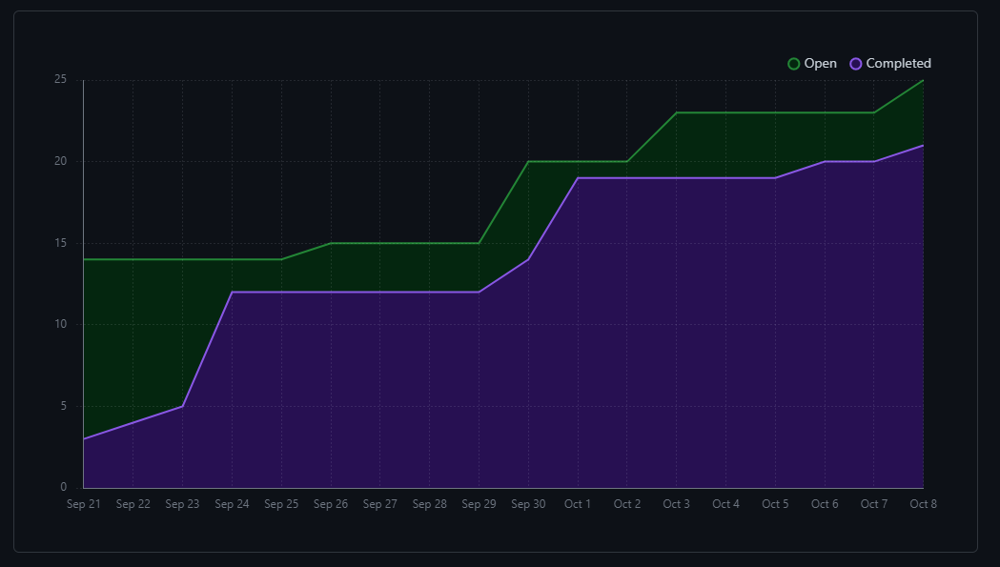
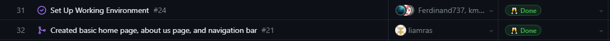
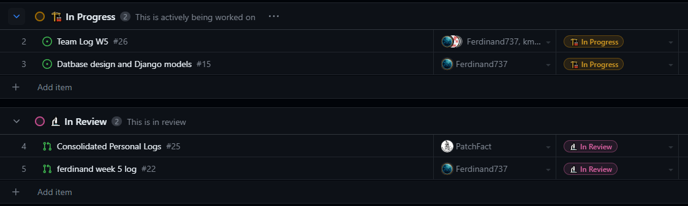

# Team 7 Log

| Full Name        | GitHub username                                 |
| ---------------- | ----------------------------------------------- |
| Esteban Martinez | [PatchFact](https://github.com/PatchFact)       |
| Ferdinand Haaben | [Ferdinand737](https://github.com/Ferdinand737) |
| Keiran Malott    | [kmalott](https://github.com/kmalott)           |
| Liam Rasmussen   | [liamras](https://github.com/liamras)           |

## Oct 1 2023 -> Oct 8 2023

### Recap of goals

| Feature                                | Members                          | Link(s)         | Status    | Notes                                                                                                |
| -------------------------------------- | -------------------------------- | --------------- | --------- | ---------------------------------------------------------------------------------------------------- |
| Set up Working Environment for Project | Esteban, Ferdinand, Keiran, Liam | [Setting Up][1] | Completed | All group members have properly set up the project in their respective OSes and can make new changes |
| Trouble Shooting                       | Ferdinand, Esteban               | None            | Completed | Helping teammates setup Django/Troubleshoot/WSL                                                      |
| Basic Home Page + About Us             | Liam                             | None            | Completed | Created basic home page landing, nav bar, and about us page                                          |

[1]: https://docs.google.com/document/d/18U3K607QbEoZFy_O4bKOMl64O0OOUe0IOVW4NVq2NdY/
[2]: https://github.com/COSC-499-W2023/year-long-project-team-7/issues/5
[3]: https://github.com/COSC-499-W2023/year-long-project-team-7/pull/6

 

 
_Burnup chart Screenshot_

 
_Completed tasks Screenshot_

 
_In-Progress tasks Screenshot_

 

_No Test output Screenshot (No testing needed)_
